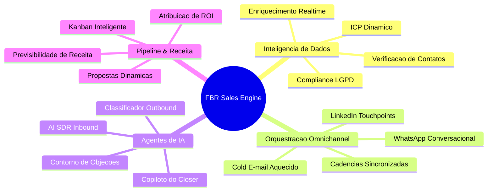
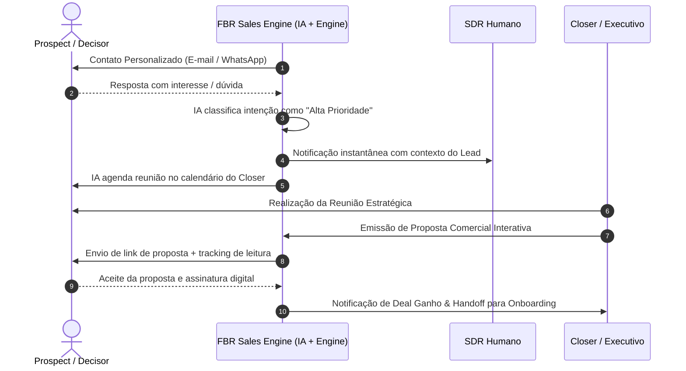

# Documento Conceitual — FBR Sales Engine

---

## 1. Visão Executiva & Tese de Negócio

### 1.1. O que é o FBR Sales Engine?
O **FBR Sales Engine** é a infraestrutura unificada de inteligência comercial e aceleração de receitas desenvolvida para a **FBR Agency** e ecossistema de clientes. Ele combina captação ativa de dados, prospecção autônoma multicanal, agentes de Inteligência Artificial para qualificação em tempo real e um pipeline de conversão com supervisão humana estratégica (*Human-in-the-Loop*).

### 1.2. A Tese Central
> *"Vendas B2B de alta conversão não dependem de volume cego de abordagens, mas sim da união entre dados enriquecidos de alta precisão, relevância contextual em múltiplos canais simultâneos e resposta imediata a oportunidades de compra."*

---

## 2. O Problema de Mercado & A Oportunidade

### 2.1. Os Gargalos Tradicionais de Vendas B2B
1. **Dispersão de Ferramentas (Tool Fatigue):** Equipes comerciais usam uma ferramenta para extração de leads, outra para cold mail, WhatsApp no celular pessoal, CRM isolado e planilhas desconectadas.
2. **Tempo de Resposta Lento (Lead Decay):** Leads inbound demoram horas ou dias para receber primeiro contato, perdendo 80% do potencial de conversão.
3. **Abordagens Genéricas e Baixa Entregabilidade:** Disparos em massa não personalizados resultam em e-mails caindo em spam e números de WhatsApp banidos.
4. **Perda de Contexto no Handoff:** O SDR qualifica o lead, mas o Closer entra na reunião sem entender as dores reais discutidas nas etapas anteriores.

### 2.2. A Oportunidade do Sales Engine
Construir uma plataforma proprietária e modular que automatiza até 80% das tarefas operacionais repetitivas de pré-vendas (pesquisa, enriquecimento, disparo, triagem de resposta e agendamento), liberando os profissionais para focar em **negociação, relacionamento e fechamento**.

---

## 3. Pilares Conceituais do Sistema

### 3.1. Inteligência de Dados & ICP Preciso
O motor não dispara para listas estáticas e desatualizadas. Ele opera com base em **critérios de ICP (Ideal Customer Profile)** rigorosos:
- Segmentação por faturamento, número de funcionários, tecnologias utilizadas e cargos tomadores de decisão.
- Enriquecimento e validação contínua de e-mails corporativos e números diretos de WhatsApp.

### 3.2. Orquestração Multicanal Integrada
A abordagem ao decisor ocorre de forma orquestrada, não invasiva e com consistência de mensagem:
- **E-mail:** Primeiro toque formal, contextualizado com notícias ou dores do setor.
- **WhatsApp:** Contato ágil para follow-up ou confirmação de presença em reuniões.
- **LinkedIn:** Engajamento social prévio para gerar autoridade e reconhecimento de marca.

### 3.3. IA com Agentes Especializados
Diferente de chatbots genéricos baseados em regras rígidas, o Sales Engine utiliza agentes autônomos com funções bem delimitadas:
- **Agente SDR Inbound:** Atende em menos de 2 minutos, tira dúvidas sobre os serviços, aplica critérios BANT/MEDDIC e oferece horários da agenda.
- **Agente Classificador Outbound:** Interpreta a intenção de cada resposta recebida e prioriza no painel do operador comercial.
- **Agente Copiloto do Closer:** Gera resumos executivos do prospect antes da reunião, identificando possíveis objeções e argumentos-chave.

### 3.4. Governança com "Human-in-the-Loop" (Gates de Decisão)
A autonomia da IA nunca compromete a segurança ou a reputação da marca:
- Disparos de novas campanhas em grande escala exigem liberação manual.
- Qualquer ação de alto impacto financeiro (gastos em APIs ou Ads) possui travas automáticas de teto orçamentário.
- Toda resposta com alta sensibilidade pode ser configurada para revisão humana antes do envio.

---

## 4. Personas & Jornadas no Ecossistema

| Ator | Papel no Sistema | Valor Percebido |
| :--- | :--- | :--- |
| **Diretoria / Gestor Comercial** | Acompanha dashboards de receita, taxas de conversão por canal e performance da equipe. | Previsibilidade de faturamento, controle de CAC e clareza de ROI. |
| **SDR / BDR** | Opera os leads priorizados pela IA, ajusta copies e gerencia respostas de alto interesse. | Menos tempo digitando mensagens e mais reuniões agendadas por dia. |
| **Closer / Executivo** | Conduz reuniões com leads já qualificados, emite propostas dinâmicas e faz fechamentos. | Reuniões mais produtivas, histórico claro e suporte no follow-up. |
| **Lead / Tomador de Decisão** | Recebe comunicações relevantes, no canal certo, com respostas rápidas e sem atrito. | Experiência de compra fluida, profissional e personalizada. |

---

## 5. Jornada do Lead no Funil do Sales Engine

---

## 6. Diferenciais Competitivos

1. **Arquitetura Proprietária & Sem Dependência Excessiva de Plataformas Fechadas:** Controle total sobre os dados, custos de infraestrutura e personalização das regras de negócio.
2. **Integração Nativa de IA Contextual:** A IA conhece a proposta de valor da FBR Agency, cases de sucesso e personas-alvo, gerando respostas com tom de voz alinhado.
3. **Foco em Conversão e Menos Fricção:** Eliminação de formulários extensos; foco em canais diretos (WhatsApp e E-mail) com agendamento via link dinâmico.
4. **Métricas de Receita Reais:** Atribuição transparente de cada real investido em prospecção versus receita gerada no fechamento.

---

## 7. Critérios de Sucesso do Projeto Conceitual

- [x] Clareza total sobre a proposta de valor e limites do produto.
- [x] Alinhamento das personas, jornadas e papéis humanos vs. inteligência artificial.
- [x] Estrutura preparada para suportar a arquitetura técnica (`03-arquitetura/`), modelagem de dados (`04-database/`) e desenvolvimento (`09-codigo/`).
