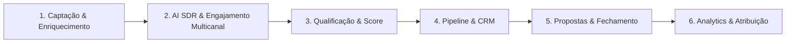

# PRD Inicial — FBR Sales Engine

## 1. Visão Geral do Produto

O **FBR Sales Engine** é uma plataforma integrada de inteligência comercial, automação de prospecção, qualificação com IA e gestão de pipeline para a **FBR Agency** e seus clientes. O objetivo central é transformar o processo de vendas em uma esteira previsível, escalável e orientada a dados, combinando automações autônomas com supervisão humana estratégica (*Human-in-the-Loop*).

---

## 2. Objetivos de Negócio & KPIs

### 2.1. Objetivos Primários
- **Previsibilidade de Pipeline:** Garantir volume constante de reuniões qualificadas agendadas.
- **Redução do CAC e Tempo de Ciclo:** Encurtar o tempo entre primeiro contato e fechamento através de nutrição e follow-ups inteligentes.
- **Eficiência Operacional do SDR/Closer:** Eliminar tarefas manuais repetitivas (busca de dados, envio manual de mensagens, agendamento e anotações).

### 2.2. Indicadores-Chave de Sucesso (KPIs)
- **Taxa de Resposta e Engajamento:** % de leads que interagem com as cadências multicanal.
- **Taxa de Qualificação (SQL / MQL):** Proporção de reuniões agendadas com tomadores de decisão no ICP ideal.
- **Taxa de Conversão em Vendas:** % de propostas ganhas no funil.
- **SLA de Primeiro Atendimento Inbound:** Tempo de resposta < 2 minutos via agentes de IA.

---

## 3. Personas & Usuários

1. **Gestor Comercial / Diretor de Vendas:**
   - *Necessidade:* Visão holística do funil, previsibilidade de receita, performance dos canais e ROI.
2. **SDR / BDR (Representante de Pré-vendas):**
   - *Necessidade:* Leads enriquecidos prontos para contato, automação de cadências e triagem rápida de respostas positivas.
3. **Closer / Executivo de Contas:**
   - *Necessidade:* Contexto completo do lead antes da call, histórico de conversas, gerador de propostas e follow-up pós-reunião.
4. **Lead / Prospect:**
   - *Experiência:* Comunicação personalizada, contextualizada, sem sensação de spam robótico genérico.

---

## 4. Pilares e Módulos do Sales Engine

### 4.1. Módulo 1: Captação de Dados & Enriquecimento (Lead Engine)
- **Definição de ICP Dinâmico:** Filtros por segmento (CNAE/Setor), faturamento estimado, número de funcionários, tecnologias utilizadas e localização.
- **Enriquecimento Automático:**
  - Consulta e validação de e-mails corporativos (verificação MX/SMTP em tempo real).
  - Obtenção de telefones/WhatsApp válidos e perfis do LinkedIn dos tomadores de decisão (C-Level / Diretores).
  - *Data Cleansing:* Deduplicação automática e validação de compliance (LGPD/Opt-out).

### 4.2. Módulo 2: Motor de Cadência Multicanal & AI Outreach
- **Sequenciamento Omnichannel:**
  - **Cold E-mail:** Envio com rotação de caixas de entrada (Mailbox Rotation), aquecimento de domínio (Warmup), limites inteligentes de entrega diária e suporte a Spintax.
  - **WhatsApp Integrado:** Disparos e respostas contextuais via API oficial / gateway homologado com proteção anti-bloqueio.
  - **LinkedIn Touchpoints:** Tarefas automatizadas e assistidas para conexão e mensagens personalizadas.
- **Personalização Dinâmica por IA:** Injeção de pontos de contato específicos da empresa abordada (notícias recentes, vagas abertas, cases semelhantes).

### 4.3. Módulo 3: AI SDR & Qualificação em Tempo Real (Conversational Engine)
- **Atendimento Inbound Instantâneo:** IA conectada ao WhatsApp e Site para responder dúvidas, qualificar com base em BANT/MEDDIC e oferecer agenda.
- **Classificador de Respostas Outbound:** Leitura automática de respostas em caixas de e-mail e WhatsApp:
  - *Positiva / Interesse:* Notificação imediata ao SDR com sugestão de horários de reunião.
  - *Objeção / Dúvida:* Geração de rascunho de resposta contextual.
  - *Não no momento:* Agendamento de follow-up automático para X meses.
  - *Descadastro / Opt-out:* Inclusão imediata em lista de supressão (Blacklist).

### 4.4. Módulo 4: Pipeline de Oportunidades & Gestão de CRM
- **Quadro Kanban Interativo:**
  - Visualização de etapas: *Descoberta, Qualificado, Reunião Agendada, Reunião Realizada, Proposta Enviada, Negociação, Ganho / Perdido*.
  - Histórico cronológico unificado (e-mails, WhatsApp, gravações e anotações).
- **Agendamento Inteligente:** Integração com Google Calendar/Outlook com distribuição de reuniões (Round-Robin) entre Closers.

### 4.5. Módulo 5: Propostas Inteligentes & Fechamento
- **Gerador de Propostas Comerciais:** Criação dinâmica de propostas interativas (PDF / Web link) baseadas no escopo e valores preenchidos.
- **Follow-up Automático Pós-Proposta:** Gatilhos automáticos caso o prospect visualize a proposta e não responda em X dias.
- **Assinatura Eletrônica & Onboarding:** Disparo automático de contrato após aceite.

### 4.6. Módulo 6: Analytics, Atribuição & Inteligência de Receita
- **Métricas de Prospecção:** Taxas de abertura, resposta, bounce rate, taxa de reuniões agendadas por canal.
- **Funil de Conversão Comercial:** Conversão etapa a etapa e identificação de gargalos no pipeline.
- **Score de Performance de Campanhas & Vendedores:** Ranking de produtividade e conversão.

---

## 5. Arquitetura Funcional & Regras de Segurança (Gates)

Seguindo as diretrizes do FBR Engine:
- **Human-in-the-Loop (Gates Obrigatórios):**
  - Aprovação manual obrigatória antes do disparo de novas campanhas em massa.
  - Alertas de orçamento e saldo em integrações pagas (OpenAI, WhatsApp APIs, Scraping).
  - Confirmação de exclusão definitiva de registros ou contatos.
- **Segurança de Credenciais:**
  - Nenhuma API key exposta no front-end ou versionada no Git.
  - Uso de variáveis de ambiente gerenciadas no backend.

---

## 6. Roadmap de Implementação por Fases

| Fase | Foco Principal | Entregáveis |
| :--- | :--- | :--- |
| **Fase 1: MVP Core** | Estrutura de Leads & Pipeline | CRUD de Leads/Empresas, Quadro Kanban de Oportunidades, Integração com Calendário e Enriquecimento básico. |
| **Fase 2: Motor Outbound & IA** | Cadências e Qualificação | Motor de e-mail com rotação/templates, WhatsApp Bot para qualificação inicial e classificador de intenção com IA. |
| **Fase 3: Automação Avançada** | Propostas e Omnichannel | Gerador de propostas web, cadência completa multicanal (Email + WhatsApp + LinkedIn), Human-in-the-loop gates. |
| **Fase 4: BI & Otimização** | Analytics e Auto-Otimização | Dashboards de ROI e CAC, relatórios preditivos de receita e testes A/B automatizados de copies. |

---

## 7. Próximos Passos & Decisões Arquiteturais
1. Definir os provedores externos de integração prioritários (ex: OpenAI/Claude para IA, Resend/SendGrid para E-mail, Z-API/Evolution para WhatsApp).
2. Modelagem do schema de banco de dados (`04-database/`) com tabelas de Leads, Campanhas, Mensagens, Atividades e Oportunidades.
3. Criação da estrutura Next.js App Router + TypeScript em `09-codigo/`.
