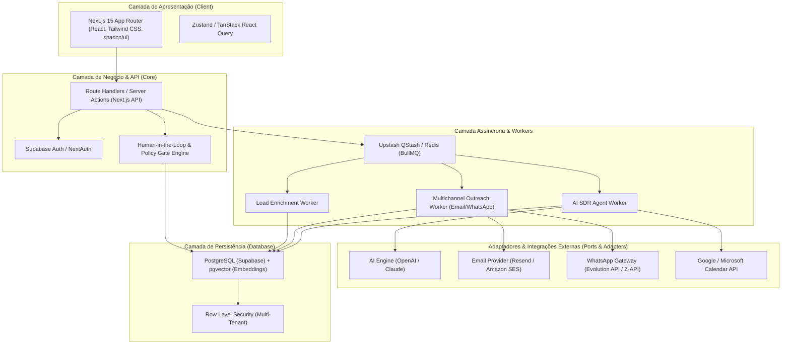

# Arquitetura Técnica — FBR Sales Engine

---

## 1. Visão Geral da Arquitetura

O **FBR Sales Engine** é projetado seguindo o padrão de **Arquitetura Modular em Camadas (Layered Modular Architecture)**, com separação explícita entre front-end, API/Backend, processamento assíncrono de filas e adaptadores de serviços externos.



---

## 2. Padrões Arquiteturais e Decisões de Design

### 2.1. Padrão Ports & Adapters (Hexagonal)
Toda comunicação com serviços externos (provedores de e-mail, gateways de WhatsApp, provedores de LLM) deve passar por uma interface abstrata (`adapter`), garantindo que o núcleo da aplicação não fique acoplado a uma API específica.

```typescript
// Exemplo de contrato de adaptador para WhatsApp
export interface IWhatsAppAdapter {
  sendMessage(to: string, content: string): Promise<{ messageId: string; status: 'sent' | 'queued' | 'failed' }>;
  sendMedia(to: string, mediaUrl: string, caption?: string): Promise<{ messageId: string; status: 'sent' | 'failed' }>;
  onWebhookReceived(payload: any): Promise<ParsedIncomingMessage>;
}
```

### 2.2. Human-in-the-Loop Gate Engine (Segurança Operacional)
Operações sensíveis são interceptadas antes da execução assíncrona:
- **Disparos em massa (> 50 contatos/dia por caixa):** Cria um registro com status `PENDING_HUMAN_APPROVAL` na tabela `audit_gates`.
- **Ações Financeiras / Custo de API:** Limite de consumo diário parametrizado por workspace.
- **Opt-out & Blacklist:** Adição imediata a listas de supressão sem necessidade de aprovação.

---

## 3. Fluxo de Dados & Comunicação Assíncrona

### 3.1. Processamento de Webhooks (WhatsApp / Respostas de E-mail)
1. O webhook do provedor recebe a mensagem de um lead e dispara a rota `/api/webhooks/[provider]`.
2. A rota valida a assinatura criptográfica do webhook e enfileira o payload na fila de processamento rápido.
3. O **AI SDR Worker** consome a mensagem, busca o histórico do lead e calcula o score/intenção usando a LLM.
4. Se o lead demonstrar intenção positiva de reunião, o worker consulta a disponibilidade do calendário via `CalendarAdapter` e propõe horários ou aciona o SDR humano.

---

## 4. Estratégia de Segurança & Multi-Tenancy

- **Isolamento de Dados (RLS):** Toda query ao banco filtra pelo `workspace_id` do usuário logado.
- **Gestão de Segredos:** Tokens de provedores e chaves de API nunca são expostos no bundle do cliente.
- **Criptografia em Repouso:** Credenciais de canais de clientes conectadas são salvas com criptografia AES-256 no banco.
