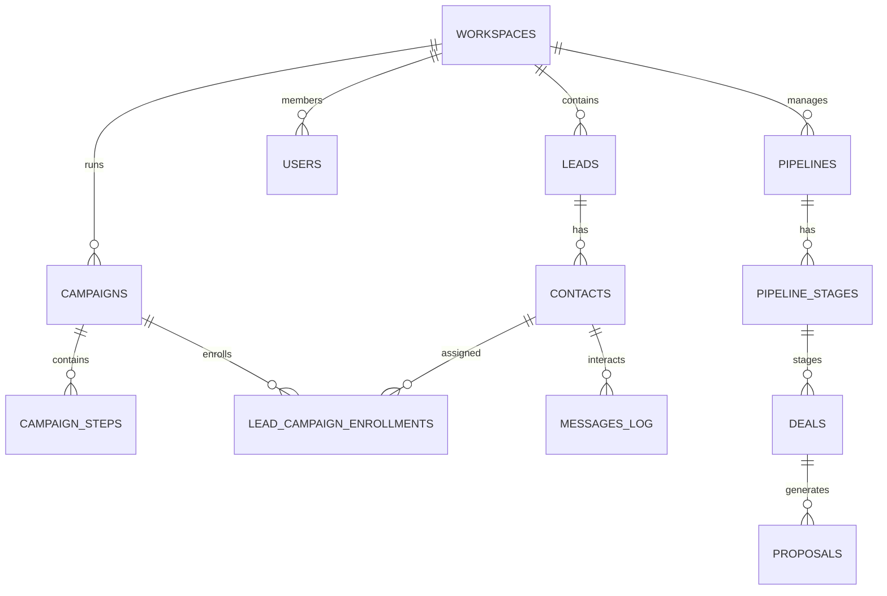

# Dicionário de Dados — FBR Sales Engine

Documento de referência para o schema relacional PostgreSQL / Supabase.

---

## 1. Mapeamento de Entidades

---

## 2. Descrição das Tabelas Principais

### 2.1. `workspaces`
- **Finalidade:** Isolamento multi-tenant de dados para a FBR Agency ou contas de clientes.
- **Campos-chave:** `id` (UUID), `name`, `slug`, `settings` (JSONB com limites e configs de canais).

### 2.2. `leads` & `contacts`
- **`leads`:** Representa a pessoa jurídica (empresa-alvo), CNAE, porte, website, faturamento estimado e `icp_score` (0 a 100).
- **`contacts`:** Decisores e executivos vinculados à empresa (nome, cargo, e-mail verificado, WhatsApp, LinkedIn e flag de `opt_out`).

### 2.3. `campaigns` & `campaign_steps`
- **`campaigns`:** Campanhas de prospecção outbound com limites diários e janelas de horário permitidas.
- **`campaign_steps`:** Passos sequenciais de cada cadência (Email -> Aguarda 2 dias -> WhatsApp -> Tarefa LinkedIn), com templates e suporte a Spintax.
- **`lead_campaign_enrollments`:** Rastreamento do progresso individual de cada contato na cadência.

### 2.4. `messages_log`
- **Finalidade:** Histórico unificado de todas as interações inbound e outbound em todos os canais.
- **Campos especiais:** `ai_intent_classified` (intenção detectada pela IA) e `ai_confidence_score`.

### 2.5. `pipelines`, `pipeline_stages`, `deals` & `proposals`
- **`pipelines` & `pipeline_stages`:** Estrutura do Kanban comercial com probabilidades de fechamento por etapa.
- **`deals`:** Negócios em andamento, valores estimados, vendedor responsável e data prevista de fechamento.
- **`proposals`:** Propostas interativas enviadas via link público com contagem de visualizações (`view_count`) e aceite digital.

### 2.6. `audit_gates`
- **Finalidade:** Log de governança e aprovação humana (*Human-in-the-Loop*) para ações sensíveis de disparo ou custo.
