# Workflows Operacionais — FBR Sales Engine

---

## 1. Mapeamento de Workflows Principais

```mermaid
flowchart TD
    subgraph WF1 ["Workflow 1: Inbound Lead -> AI SDR -> Reunião"]
        A1[Lead preenche form ou envia WhatsApp] --> A2[AI SDR responde em < 2 min]
        A2 --> A3{Qualificado no ICP?}
        A3 -- Sim --> A4[Gera link dinâmico de agenda do Closer]
        A3 -- Não --> A5[Nutrição em lista educacional]
        A4 --> A6[Reunião confirmada + Notificação Slack/WhatsApp]
    end

    subgraph WF2 ["Workflow 2: Outbound Omnichannel Cadence"]
        B1[Importação / Scraping de Contatos] --> B2[Enriquecimento & Validação de E-mail]
        B2 --> B3[Gate Humano: Aprovação de Disparo em Lote]
        B3 --> B4[Disparo Step 1: E-mail Personalizado]
        B4 --> B5{Houve Resposta em 48h?}
        B5 -- Não --> B6[Disparo Step 2: WhatsApp Amigável]
        B5 -- Sim: Positiva --> B7[SDR acionado imediatamente]
        B5 -- Sim: Opt-out --> B8[Adição à Blacklist automática]
    end

    subgraph WF3 ["Workflow 3: Negociação -> Proposta -> Fechamento"]
        C1[Closer realiza reunião diagnóstica] --> C2[Criação de Proposta no Sales Engine]
        C2 --> C3[Envio de Link Interativo da Proposta]
        C3 --> C4[Tracking de Abertura & Tempo de Leitura]
        C4 --> C5{Aceite do Cliente?}
        C5 -- Sim --> C6[Disparo automático do Contrato & Onboarding]
        C5 -- Sem resposta 72h --> C7[Follow-up automatizado do Closer]
    end
```

---

## 2. Detalhamento dos Gatilhos e Ações

### 2.1. Workflow 1: Atendimento Inbound com AI SDR
- **Trigger:** Evento de webhook `lead.created` vindo de página de captura ou mensagem recebida na Evolution API/WhatsApp.
- **Passo 1 (Triagem):** A LLM extrai: Nome, Empresa, Cargo, Faturamento aproximado, Desafio principal.
- **Passo 2 (Scoring):** Se `icp_score >= 70`, envia os horários livres da agenda do Closer responsável via Round-Robin.
- **Passo 3 (Handoff):** Envia mensagem resumida no canal interno (Slack/Discord/WhatsApp da equipe) com a ficha do lead e horário reservado.

### 2.2. Workflow 2: Cadência Outbound Omnichannel
- **Trigger:** Acionamento de campanha ativa agendada nos horários de funcionamento configurados (Seg-Sex, 09h às 18h).
- **Proteção:** Rate limiting de no máximo 40 e-mails por caixa postal/dia e 30 mensagens de WhatsApp com delay randômico de 45 a 120 segundos entre envios.
- **Tratamento de Bounce:** Bounces são marcados como `email_status = 'invalid'` imediatamente.

### 2.3. Workflow 3: Handoff de Fechamento & Assinatura
- **Trigger:** Alteração de status da proposta para `accepted`.
- **Ações:**
  1. Marca o Deal como `WON` no pipeline.
  2. Notifica a equipe de Sucesso do Cliente / Operações para início do onboarding.
  3. Atualiza métricas de ROI e CAC em tempo real no dashboard.
