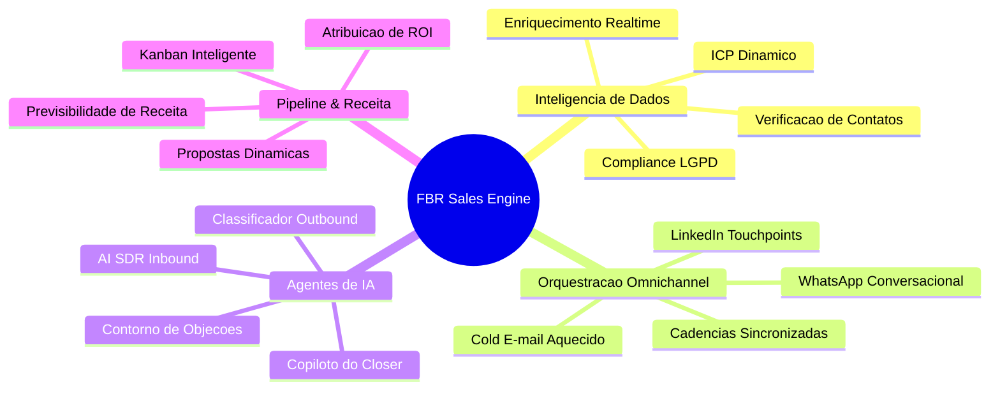
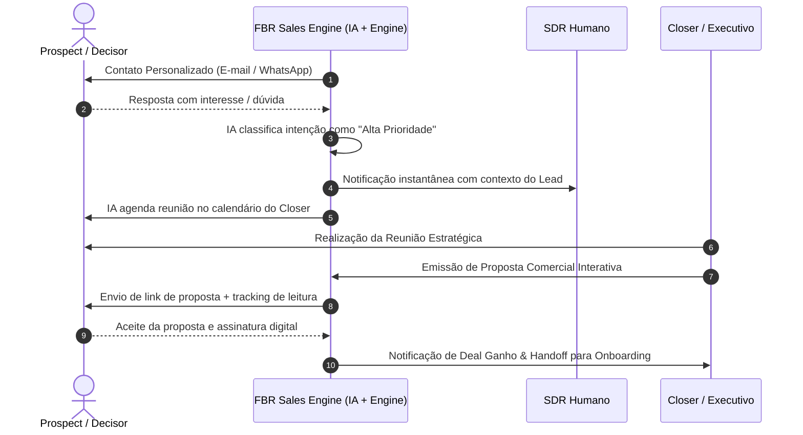

# FBR Sales Engine — B2B Revenue Acceleration Platform

<div align="center">


**Plataforma de inteligência comercial, prospecção autônoma multicanal, qualificação por IA e gestão de pipeline provisionada pela FBR Control Tower.**

</div>

---

## 1. Identidade & Provisionamento (FBR Control Tower)

- **Project ID:** `7c69fcc5-f22c-4b54-9efd-f0b8ed9d4b72`
- **Slug:** `sales`
- **Template:** `custom_base` (v1.0.0)
- **Schema exclusivo:** `custom_salesengine`
- **Domínio Oficial:** `sales.fbr.news`
- **Healthcheck de Validação:** `https://sales.fbr.news/health` (Porta: `3400`)
- **Target Server:** `vps2` (Easypanel Project: `sistemas` | Service: `sales`)
- **Repository Path:** `/09-codigo`

---

## 2. Visão Executiva & Tese de Negócio

### 2.1. O que é o FBR Sales Engine?
O **FBR Sales Engine** é a plataforma unificada de aceleração de receitas e inteligência de vendas desenvolvida para a **FBR Agency** e ecossistema de clientes. Ele integra captação ativa de dados de decisores, sequenciamento outbound multicanal (E-mail + WhatsApp), agentes de Inteligência Artificial para qualificação em tempo real e um pipeline de conversão com supervisão humana estratégica (*Human-in-the-Loop*).

### 2.2. A Tese Central
> *"Vendas B2B de alta conversão não dependem de volume cego de abordagens, mas sim da união entre dados enriquecidos de alta precisão, relevância contextual em múltiplos canais simultâneos e resposta imediata a oportunidades de compra."*

---

## 3. Pilares Conceituais do Sistema



---

## 4. Jornada do Lead no Funil do Sales Engine



---

## 5. Estrutura do Repositório

```text
├── 01-conceitual/      # Visão, tese de mercado e personas
├── 02-prd/             # Requisitos, backlog de Sprints e documentação de provisionamento (sales-dev-doc.md)
├── 03-arquitetura/     # Arquitetura Ports & Adapters, ADR-001 e Guia Easypanel
├── 04-database/        # Schema custom_salesengine, Dicionário de Dados e RLS
├── 05-workflows/       # Workflows operacionais e fluxos n8n/webhooks
├── 06-design/          # Design Tokens (Dark Slate, Glassmorphism, Typography)
├── 07-marketing/       # Posicionamento, ofertas e mensagens
├── 08-historico/       # Decisões arquiteturais e receipts
└── 09-codigo/          # Aplicação Next.js 15 + TypeScript + Tailwind CSS (Porta 3400)
```

---

## 6. Stack Tecnológica

- **Front-end & API Framework:** Next.js 15 (App Router) + TypeScript
- **Design System:** Tailwind CSS + Radix UI + Lucide Icons (Dark Mode & Glassmorphism)
- **Banco de Dados Central:** Supabase (PostgreSQL 15+ no schema exclusivo `custom_salesengine` com `pgvector`, Auth e Realtime)
- **Containerização & Deploy:** Docker Multi-stage + Easypanel (`vps2` / `sistemas` / `sales` na porta `3400`)
- **Inteligência Artificial:** OpenAI API (GPT-4o/mini) + Anthropic Claude
- **Provedores de Mensageria:** Resend (E-mail) + Evolution API (WhatsApp)

---

## 7. Procedimento de Deploy no Easypanel (vps2)

Para detalhes completos de configuração, consulte o documento [**03-arquitetura/DeployEasypanel.md**](file:///03-arquitetura/DeployEasypanel.md).

1. No Easypanel da `vps2`, abra o projeto **sistemas** e o serviço **sales**.
2. Na aba **Source**:
   - **Repositório:** `appbigwriter/salesengine`
   - **Branch:** `main`
   - **Root Directory / Build Path:** `09-codigo`
   - **Build Type:** `Dockerfile`
3. Na aba **Domains**: adicione `sales.fbr.news` na porta `3400` com SSL automático.
4. Na aba **Environment**: cole as variáveis de runtime do arquivo [`.env.example`](file:///.env.example).
5. Execute **Deploy** e valide `https://sales.fbr.news/health` (HTTP 200).

---

## 8. Execução Local

```bash
cd 09-codigo
npm install
npm run dev
```

---

<div align="center">
  <sub>FBR Agency © 2026. Todos os direitos reservados.</sub>
</div>
